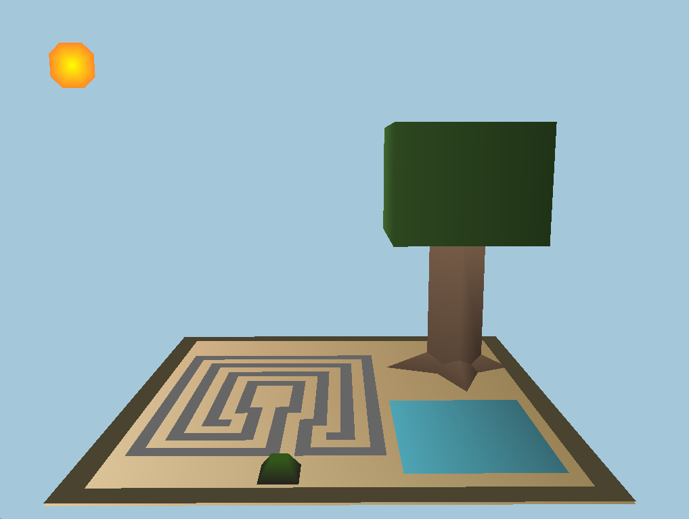

## CSCI3260 Assignment 1 Keyboard / Mouse Events

 - Name: Lau Long Ching 		
 - Student ID:	1155127347

 This is a Japanese rock garden (枯山水, karesansui), often called a zen  garden, which creates a miniature stylized landscape through carefully composed arrangements of rocks, water features, moss, pruned trees and
 bushes, and uses gravel or sand that is raked to represent ripples in water.

 In this zen garden, you can engage in a spiritual journey by a meandering walk to the center of the labyrinth and find your inner zen. Use the arrow key to control the little rock on the ground.

Manipulation:
Key "d" : Switch between day and night.
Key "q" : Scale up the sun during daytime/ Rotate the moon anti-
		  clockwise during nighttime.
Key "e" : Scale down the sun during daytime/ Rotate the moon clockwise
		  during nighttime.
Arrows  : Control the rock on the ground.

Key "o" : Increase the FOV
Key "p" : Decrease the FOV

Discussion on this perspective matrix parameter:
By changing the FOV, we can see that how much we see of a scene also changes. However, the screen size remains the same, and therefore the points are scaled up or down depending on the FOV value. It works like 
changing the focal length of a camera, except that the screen size changes for a real camera.

Grading rubics checklist:
-------------------------
Basic (80%)

Draw at least one 2D object and two 3D objects. 25%
--- 2D: Sun, moon, ground, etc. 3D: Rock, tree.

At least one object is drawn with indexing. 10%
--- All objects are drawn with indexing.

At least three kinds of keyboard (and/or mouse) events. 15%
--- Obviously more than three kinds of events.

Include three kinds of object transformations (rotation, translation, 
scaling). 15%
--- Scaling of sun, rotation of moon, translation of rock on the ground.

Perspective projection (given). 10%
--- Sticked with the given perspective.

Depth test. 5%
--- Enabled.

-------------------------
Advanced (at most 20%)

Complex and meaningful objects and scenes constructed by different 
primitives. 10%
--- Zen garden.

Interesting and creative interactions, e.g., scene interaction or view 
angle change. 10%
--- Day/night changes, labyrinth walk, FOV change.

Try with different parameters in the perspective projection (e.g., fov, 
etc.) and discuss the effect. 5%
--- Refer to above.

-------------------------
Total (maximum): 100%
