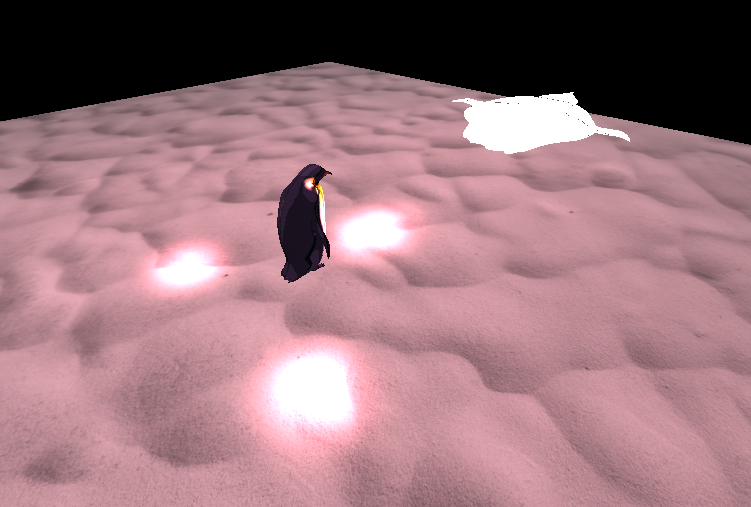

**

## CSCI3260 Assignment 2 Texture Mapping/ Lighting Control

Name: Lau Long Ching
Student ID: 1155127347

Resident Evil Penguin - This penguin has just escaped from the laboratory! It probably contains virus from an unknown country.
Help it to hop on the penguin spaceship!

Manipulation:

Key "W": brightness of light increase
Key "S": brightness of light decrease

Key "UP": Penguin moves forward
Key "Down": Penguin moves backward
Key "Left": Penguin rotates to the left
Key "Right": Penguin rotates to the Right

Key "1": Change the dolphin texture as texture1
Key "2": Change the dolphin texture as texture2
Key "3": Change the Sea texture as texture1
Key "4": Change the Sea texture as texture2

Key "D": The penguin suffered from COVID-19 and dies / The penguin revives!

Mouse left click and drag upward : whole scene moves upward
Mouse left click and drag downward : whole scene moves downward
Mouse left click and drag leftward : whole scene rotates left
Mouse left click and drag rightward : whole scene rotates Right
Mouse Scroll forward : whole scene zoom in
Mouse Scroll backward : whole scene zoom out

The diffuse light rays would change the brightness from time to time.

Grading rubics checklist:
-------------------------

Basic (80%) 

Loading the complex model 10%
Texture mapping 10%
Lighting of environment (directional) light 10%
Lighting of light source you designed 10%
Lighting control 10%
Texture control 10%
Object control 10%

Bonus Task (20%)

Load more complex models and map other textures onto them to form a meaningful scene as you like. (10%)
-- Cages for the scene
Use different types of lighting sources to make meaningful scenes, such as the combination of Pointlight, Spotlight, etc. (10%)
-- Red lights
Shadow mapping on the complex models. (10%)
Draw points or lines to trace the movement of one of the complex models. (10%)
Any other interesting effects.
-- Light intensity changes from time to time

-------------------------
Total (maximum): 100%

